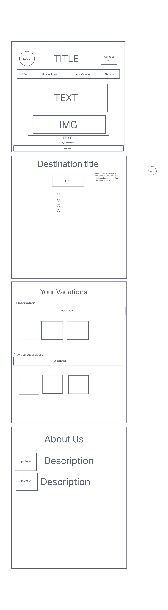

# TeamJASYproject 

## Joraya Flow  

## Yajahira Velazquez  
## Stephen Martinez  
## Adrian Cosme-Halverson  
***
### **Status**

***
Version 1.0 - built out basic html, next some CSS styling

Version 1.1 - completed JavaScript to make the html form more dynamic

Version 1.2 - completed styling, finished code tests

Version 1.4 - added a new destination, updated JavaScript constructors. Structured code to allow additonal destinations and questions to be added for potential scaling options later.

Version 1.5 - Deployed live site! 

### Wireframe and User Stories
***
  
[User Stories](https://github.com/orgs/TeamJasy/projects/1/views/1?layout=board)  
***
### Domain Model

### **Contributors**
***

### License
***

MIT © Jo Flow, Adrian Cosme-Halverson, Stephen Martinez, Yajariha Velazquez (JASY)